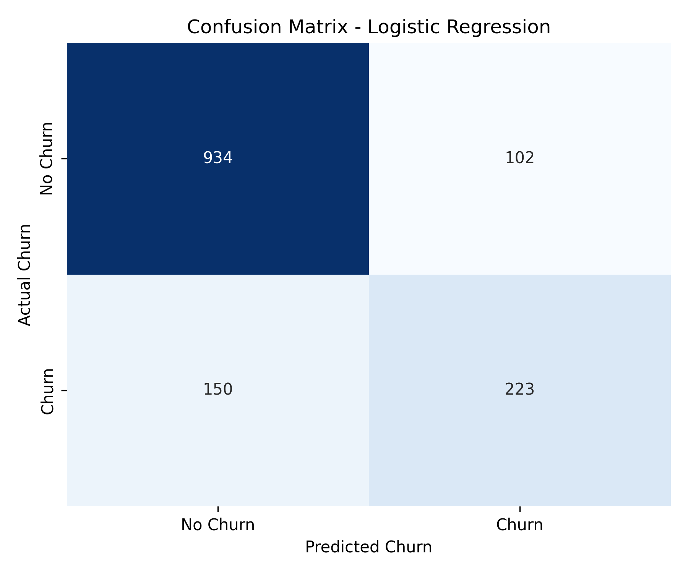

###### mponline-aiml-assg2

# Telco Customer Churn Prediction using Logistic Regression

This project builds a machine learning classification model using **Logistic Regression** to predict customer churn for a telecommunications company. Churn prediction helps identify customers likely to cancel their subscriptions, enabling proactive customer retention strategies.

---

## Objective
Develop a Logistic Regression model using customer demographics, account characteristics, and service usage features to predict whether a customer will churn (`Yes` or `No`).

## Dataset Link
* **Kaggle Link**: [Telco Customer Churn Dataset](https://www.kaggle.com/datasets/blastchar/telco-customer-churn)


## Libraries Used
* **Pandas**: Data loading, exploration, and handling missing values.
* **NumPy**: Numeric operations.
* **Scikit-Learn**: Splitting the dataset, feature scaling (StandardScaler), model fitting (LogisticRegression), and model evaluation.
* **Matplotlib & Seaborn**: Confusion matrix visualization.

---

## Methodology
The pipeline consists of the following phases:

1. **Data Understanding**:
   * Inspecting columns, types, and values.
   * Categorizing features into **numerical** (`tenure`, `MonthlyCharges`, `TotalCharges`), **categorical** (e.g., `gender`, `Contract`, `InternetService`), and **target** (`Churn`).

2. **Data Preprocessing**:
   * Coerced `TotalCharges` from string to numeric type. This highlighted 11 missing values which were empty strings (`" "`) belonging to customers with `tenure = 0`.
   * Imputed these 11 missing values with `0.0` (since they represent brand-new customers who have not completed their first billing cycle).
   * Encoded binary features and target (`Churn`) to `0`/`1`.
   * One-hot encoded multi-class categorical variables using `pd.get_dummies(drop_first=True)` to prevent multicollinearity.
   * Split the dataset into **80% training** and **20% testing** subsets.
   * Standardized continuous numerical columns using `StandardScaler` to ensure coefficients converge and scale equivalently.

3. **Model Development**:
   * Trained a Scikit-Learn `LogisticRegression` model with L2 regularization (`max_iter=1000`, `random_state=42`) on the scaled training features.
   * Predicted churn labels on the test set.

4. **Evaluation**:
   * Evaluated predictions on the test set using Accuracy, Precision, Recall, F1-Score, and a Confusion Matrix.

---

## Results

### Model Performance Metrics
| Metric | Score (Decimal) | Score (%) |
| :--- | :--- | :--- |
| **Accuracy Score** | 0.8211 | 82.11% |
| **Precision** | 0.6862 | 68.62% |
| **Recall (Sensitivity)** | 0.5979 | 59.79% |
| **F1-Score** | 0.6390 | 63.90% |

### Confusion Matrix
The confusion matrix below details predictions on the 1,409 test samples:

* **True Negatives (TN)**: 934 (Predicted No Churn, Actual No Churn)
* **False Positives (FP)**: 102 (Predicted Churn, Actual No Churn)
* **False Negatives (FN)**: 150 (Predicted No Churn, Actual Churn)
* **True Positives (TP)**: 223 (Predicted Churn, Actual Churn)

```
[[934 102]
 [150 223]]
```



### Key Observations
1. **Accuracy vs. Recall Imbalance**: While the model is highly accurate overall (82.11%), its recall of 59.79% shows that it misses 40% of churning customers. This is due to class imbalance (more non-churners than churners in the dataset).
2. **Actionable Precision**: The precision score of 68.62% guarantees that if the model flags a customer as a churn risk, there is a ~69% chance they actually intend to leave. This avoids distributing retention discounts to customers who would stay anyway.
3. **Feature Influence**: Coefficients reveal that **longer-term contracts** (Two-year, One-year) and **higher tenure** are strongly associated with lower churn rates. Meanwhile, **fiber optic internet service** and **electronic check payments** are the strongest predictors of high churn.

---

## Conclusion
This study successfully developed a Logistic Regression model to predict customer churn with 82.11% accuracy. Key findings indicate that customer tenure and contract duration (specifically one-year and two-year contracts) are the most significant protective factors, strongly correlating with reduced customer churn. In contrast, customers using fiber optic internet service or electronic checks as their payment method display a significantly higher likelihood of churning. 

A major limitation of Logistic Regression in this scenario is its assumption of linearity between independent features and log-odds of churn. It cannot inherently capture complex, non-linear feature interactions (such as the combined effect of high monthly charges and short tenure) without manual feature engineering, which tree-based ensemble models like Random Forests or XGBoost can handle automatically.
